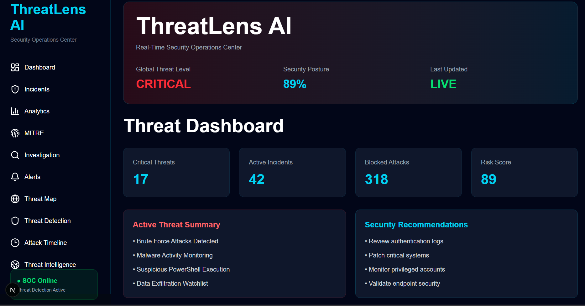
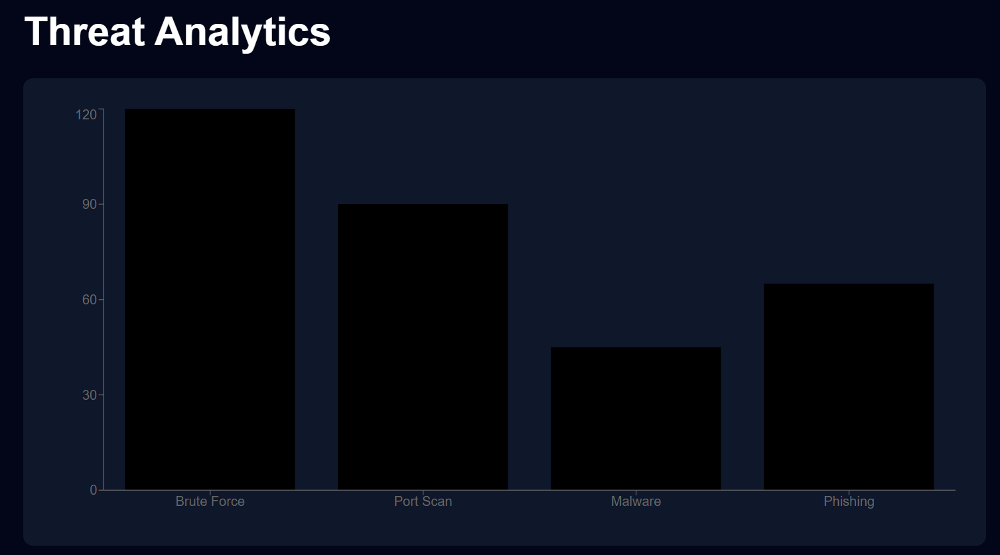
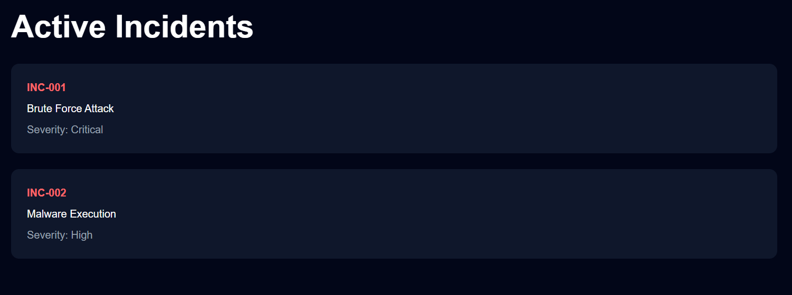
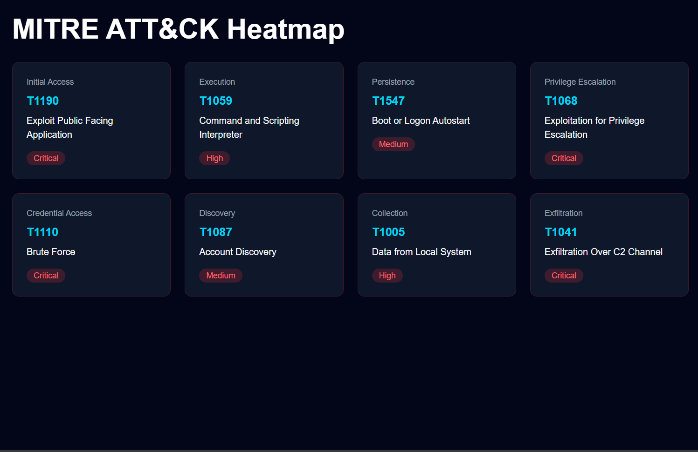
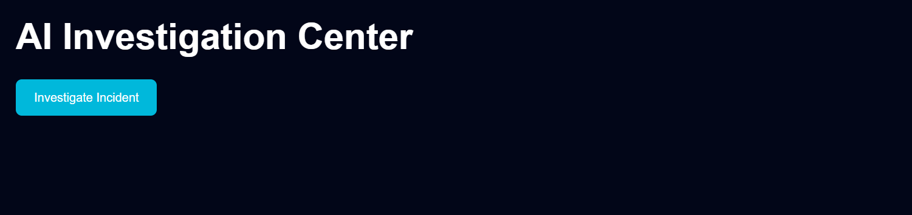
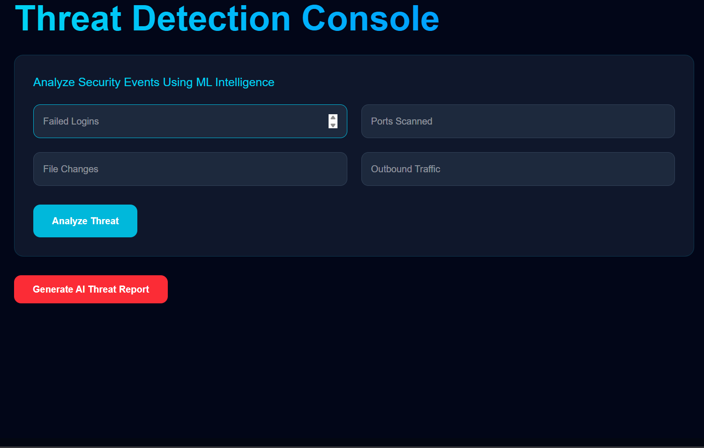

# 🛡️ ThreatLens AI


## 🚀 AI-Powered Security Operations Center (SOC)

ThreatLens AI is a next-generation Security Operations Center (SOC) platform that combines Machine Learning, Threat Intelligence, MITRE ATT&CK Mapping, and Google Gemini AI to detect, analyze, investigate, and respond to cybersecurity threats in real time.

The platform enables security analysts to monitor incidents, perform threat investigations, visualize attack trends, generate AI-powered threat reports, and assess organizational security posture from a centralized dashboard.

---

# 🌐 Live Demo

### Frontend

https://threat-lens-ai-roan.vercel.app

### Backend API

https://threatlensai-pcm5.onrender.com/docs

---

# 📌 Key Features

## 🔍 Machine Learning Threat Detection

* Real-time threat prediction
* Risk scoring engine
* Confidence-based classification
* Threat severity assessment
* Automated alert generation

### Input Parameters

* Failed Logins
* Ports Scanned
* File Changes
* Outbound Traffic

### Example Output

```json
{
  "prediction": "Malware",
  "confidence": 97.4,
  "risk_score": 97,
  "risk_level": "Critical"
}
```

---

## 🤖 AI Investigation Center

Powered by Google Gemini AI.

### Capabilities

* Automated incident analysis
* Executive summaries
* Threat assessments
* MITRE ATT&CK mapping
* Impact analysis
* Remediation recommendations

---

## 📊 Security Dashboard

Provides a centralized view of:

* Critical Threats
* Active Incidents
* Blocked Attacks
* Risk Score
* Security Posture

---

## 📈 Threat Analytics

Visualizes:

* Threat distribution
* Attack trends
* Historical incidents
* Threat frequency

Built using Recharts for interactive data visualization.

---

## 🚨 Incident Management

Track and monitor:

* Active incidents
* Incident severity
* Investigation status
* Threat lifecycle

---

## 🌍 Threat Intelligence

Displays:

* Emerging threats
* Vulnerabilities
* Cybersecurity trends
* Threat awareness feeds

---

## 🎯 MITRE ATT&CK Integration

Maps threats to:

* ATT&CK Tactics
* ATT&CK Techniques
* Attack Lifecycle Stages

Helping analysts understand adversary behavior and attack paths.

---

# 🏗️ System Architecture

```text
                    ┌───────────────────┐
                    │      User         │
                    └─────────┬─────────┘
                              │
                              ▼
                    ┌───────────────────┐
                    │   Next.js Frontend │
                    └─────────┬─────────┘
                              │
                              ▼
                    ┌───────────────────┐
                    │   FastAPI Backend │
                    └─────────┬─────────┘
                              │
        ┌─────────────────────┼─────────────────────┐
        │                     │                     │
        ▼                     ▼                     ▼

┌────────────────┐  ┌────────────────┐  ┌────────────────┐
│ ML Model       │  │ Risk Scoring   │  │ Gemini AI      │
│ Scikit-Learn   │  │ Engine         │  │ Investigation  │
└────────────────┘  └────────────────┘  └────────────────┘

                              │
                              ▼

                    ┌───────────────────┐
                    │ Security Reports  │
                    │ Threat Analysis   │
                    └───────────────────┘
```

---

# 🛠️ Technology Stack

## Frontend

* Next.js 16
* TypeScript
* Tailwind CSS
* Axios
* Recharts
* React

## Backend

* FastAPI
* Python
* Uvicorn

## Machine Learning

* Scikit-Learn
* NumPy
* Pandas
* Joblib

## Artificial Intelligence

* Google Gemini 2.5 Flash

## Deployment

* Vercel
* Render
* GitHub

---

# 📂 Project Structure

```text
ThreatLensAI
│
├── frontend
│   │
│   ├── app
│   │   ├── dashboard
│   │   ├── analytics
│   │   ├── incidents
│   │   ├── investigation
│   │   ├── mitre
│   │   ├── threat-detection
│   │   ├── threat-intelligence
│   │   ├── threat-map
│   │   └── timeline
│   │
│   ├── components
│   └── lib
│
├── backend
│   │
│   ├── app
│   │   ├── api
│   │   ├── models
│   │   ├── schemas
│   │   ├── services
│   │   └── main.py
│   │
│   ├── requirements.txt
│   └── runtime.txt
│
└── README.md
```

---

# ⚙️ Installation

## Clone Repository

```bash
git clone https://github.com/Pushkar1604/ThreatLensAi

cd SentinalAI
```

---

## Frontend Setup

```bash
cd frontend

npm install

npm run dev
```

Frontend:

```text
https://threat-lens-ai-git-main-struggler16042004s-projects.vercel.app/
```

---

## Backend Setup

```bash
cd backend

python -m venv venv
```

Activate Environment

### Windows

```bash
venv\Scripts\activate
```

### Linux/Mac

```bash
source venv/bin/activate
```

Install Dependencies

```bash
pip install -r requirements.txt
```

Run Backend

```bash
uvicorn app.main:app --reload
```

Backend:

```text
https://threatlensai-pcm5.onrender.com/
```

Swagger Docs:

```text
https://threatlensai-pcm5.onrender.com/docs
```

---

# 🧠 Machine Learning Workflow

```text
Security Metrics
       │
       ▼
Feature Processing
       │
       ▼
Threat Detection Model
       │
       ▼
Prediction
       │
       ▼
Risk Score Calculation
       │
       ▼
AI Investigation Report
```

---


# 📷 Screenshots

## Dashboard


## Analytics


## Incidents


## MITRE ATT&CK


## Investigation Center


## Threat Detection


---

# 🔥 Future Enhancements

* Real-Time Threat Feeds
* SIEM Integration
* Threat Hunting Assistant
* Cloud Security Monitoring
* Multi-Tenant Architecture
* Role-Based Access Control
* PDF Report Generation
* Security Analyst Copilot
* SOC Chat Assistant
* Live Threat Intelligence APIs

---

# 👨‍💻 Author

## Pushkar Singh

Computer Science & Engineering Student

Interests:

* Cybersecurity
* Artificial Intelligence
* Machine Learning
* Full Stack Development
* Security Operations

GitHub:
https://github.com/Pushkar1604

---

# ⭐ Support

If you found this project useful, please consider giving it a ⭐ on GitHub.

---

## Built with ❤️ using

**Next.js + FastAPI + Scikit-Learn + Google Gemini AI**
